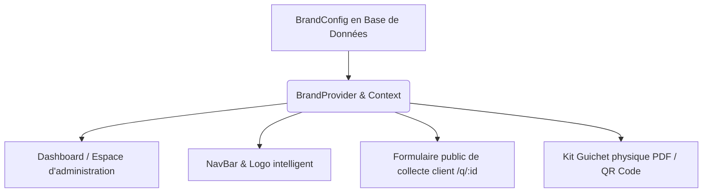

# Guide de Personnalisation Visuelle (White-Label) — CXSAT v2

Ce guide explique le fonctionnement, l'impact et l'utilisation du module de personnalisation et de White-Label multi-tenant implémenté sur la plateforme CXSAT.

---

## 1. Ce qui a été fait

Nous avons conçu et intégré un système de personnalisation visuelle dynamique et hermétique pour chaque entreprise cliente (tenant).

### A. Modèle de Données & Persistance (`schema.prisma`)
- **Modèle `BrandConfig`** : Stocke la charte graphique de chaque entreprise (couleurs HSL, typographies, styles de bordures et d'ombres), ainsi que ses ressources (logos clair/sombre, favicon) et les slogans de ses supports.
- **Opérations Wasp** : 
  - Action `upsertBrandConfig` : Permet aux profils `DIRECTION` et `QUALITE` de configurer et sauvegarder l'identité de marque de leur entreprise avec validation des formats.
  - Query `getBrandConfig` : Récupère la marque de l'entreprise connectée.
  - Query `getFormDefinitionForGuichet` : Établit la liaison pour transmettre la configuration de marque associée à un guichet aux utilisateurs anonymes sur les formulaires de collecte publics.

### B. Moteur d'Injection Dynamique (`BrandContext.tsx`)
- **Variables CSS HSL** : Le composant `BrandProvider` injecte de façon dynamique les variables de couleurs (Primary, Secondary, Background, Card, Border, Ring, etc.) et de style (Border Radius, Shadows) sous la forme de propriétés CSS personnalisées (`:root`) dans un tag `<style>` placé dans le `<head>`.
- **Typographies & Favicon** : Importe dynamiquement la police Google Fonts choisie et met à jour l'icône de l'onglet du navigateur (`favicon`) en temps réel.
- **Double preview en temps réel** : La page d'administration contient un panneau de simulation qui émule le rendu exact d'un smartphone (formulaire mobile de collecte) et d'un kit d'affichage physique imprimé.

---

## 2. Quel est l'impact sur l'Application ?

Le White-Label a un impact global et transforme l'identité visuelle de l'ensemble de l'expérience utilisateur.

### Impact visuel et fonctionnel :
1. **Dashboard & Administration** : L'espace interne adopte la charte graphique configurée (boutons, bordures, ombres, logo principal).
2. **Page de collecte publique** : Lorsqu'un client scanne le QR Code d'un guichet, la page applique l'identité visuelle de l'entreprise propriétaire de ce guichet. Si configuré, le filigrane "Propulsé par CXSAT" est masqué.
3. **Kit Guichet imprimable** : Les affiches et badges générés au format PDF pour les agences intègrent la couleur primaire, le logo et les slogans USSD configurés par l'entreprise.

---

## 3. Comment l'utiliser ?

### Étape 1 : Accéder à l'interface d'administration
Connectez-vous avec un compte possédant le rôle **DIRECTION** ou **QUALITE** et rendez-vous sur l'onglet **"Charte Graphique"** du menu de navigation (URL : `/admin/marque`).

### Étape 2 : Configurer l'identité visuelle
- **Informations générales** : Changez le nom de l'application (ex : "NSIA Satisfaction") et importez vos logos (clair, sombre, favicon).
- **Couleurs de la marque** :
  - Choisissez parmi les **Thèmes rapides en 1 clic** (CXSAT d'origine, Émeraude Zen, Océan Indigo, Royal Gold).
  - Personnalisez individuellement les couleurs à l'aide du sélecteur de couleurs (HEX). La conversion en HSL est automatique et gérée en arrière-plan.
- **Typographies et Style** :
  - Choisissez une police moderne pré-configurée (Satoshi, Inter, Outfit, Plus Jakarta Sans).
  - Ajustez l'arrondi des angles (radius) et l'intensité des ombres (Sharp, Glow, None).
- **Textes d'évaluation** :
  - Modifiez le titre, le sous-titre et le message de remerciement du formulaire.
  - Cochez "Masquer le filigrane" pour masquer toute mention de CXSAT sur le formulaire client.

### Étape 3 : Sauvegarder
Cliquez sur le bouton **"Enregistrer les modifications"**. La configuration est appliquée instantanément à toute l'entreprise.

---

## 4. Vérification et validation des logiques

Toutes les logiques ont été scrupuleusement auditées et validées :
1. **Isolation Multi-tenant (RLS)** : L'action de sauvegarde et la query de lecture vérifient systématiquement la présence d'un utilisateur authentifié et associent la configuration à `id_entreprise`. Une entreprise ne peut ni lire ni modifier la configuration d'une autre entreprise.
2. **Rôles applicatifs** : Seuls les rôles d'encadrement (`DIRECTION` et `QUALITE`) peuvent manipuler la configuration visuelle.
3. **Fallback élégant** : Si aucune personnalisation n'est configurée, l'application utilise automatiquement les assets et la palette orange & bleu par défaut de CXSAT.
4. **Fluidité (CLS/LCP)** : L'injection via tag `<style>` évite les clignotements visuels (flash of unstyled content) lors du chargement des pages de collecte mobiles.
